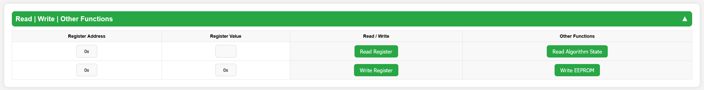

# MCF8316A GUI with ESP8266

This project provides a simple and effective way to read and write MCF8316A motor driver registers using an ESP8266 microcontroller over I2C communication.

With this setup, you can easily configure and monitor the MCF8316A without needing a full microcontroller firmware redesign. Ideal for testing, tuning, and development purposes.

This section of the project allows users to **manually read and write** registers of the **MCF8316A** device.

- **Register Address**: Enter the target register address (in hexadecimal format).
- **Register Value**: Enter the desired 32-bit value for writing.
- **Read Register**: Fetches the current value from the specified register.
- **Write Register**: Writes the given value to the specified register.

> **Important:**  
> After writing to registers, to **permanently store the changes into the MCF8316A's EEPROM**, you must press the **Write EEPROM** button.  
> Otherwise, written values will be lost after a power cycle.

Additionally, the **Read Algorithm State** button can be used to monitor the current algorithm status of the MCF8316A motor controller.
